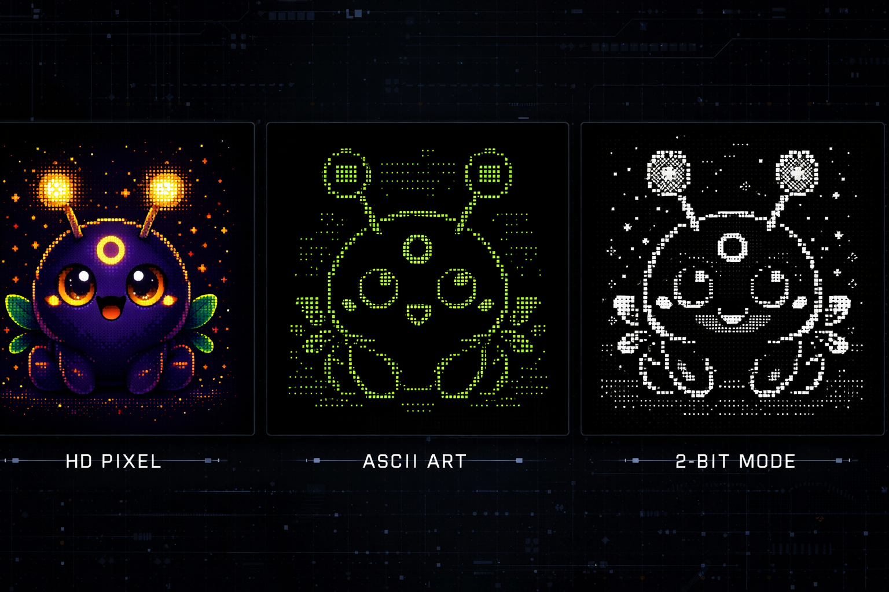

# EZ-OS: Sistema Operacional de Memória Lúdica Offline

<div align="center">


**Um sistema de memória factual para jogos retro que registra eventos reais e expressa o histórico através de um mascote procedural determinístico.**

[](LICENSE)
[](https://www.python.org/downloads/)

</div>

---

## 🎯 O que é o EZ-OS?

O **EZ-OS** (Easy Operating System) é um Sistema Operacional de Memória Lúdica. Sua função primordial é o **registro factual de eventos de uso** e a **expressão simbólica desse histórico**, operando de forma leve, offline e agnóstica de hardware.

### Princípios Não Negociáveis

- **Factualidade da Memória**: Registra apenas eventos reais
- **Estado Padrão de Silêncio**: Comunicação apenas quando relevante
- **Identidade Procedural Determinística**: Evolução baseada em dados reais e sementes únicas
- **Resiliência à Degradação**: Funcionalidade em ASCII/2-bit
- **Isolamento de IA**: Processamento pesado é externo e opcional

---

## 🚀 Instalação

### Requisitos

- Python 3.9+
- pip

### Instalação via pip (Modo Desenvolvimento)

```bash
# Clone o repositório
git clone https://github.com/ez-fundation/ez-os.git
cd ez-os

# Instale em modo desenvolvimento
pip install -e .
```

### Instalação de Dependências

```bash
pip install -r requirements.txt
```

---

## 📖 Uso

### Iniciar o EZ-OS

```bash
ez-os
```

### Uso Programático

```python
from ez_os.core import memory, companion, governance
from ez_os.ui import tui
from ez_os.launcher import launcher

# Carregar grafo de memória
graph = memory.load_graph("data/memory_graph.json")

# Atualizar estado do mascote
mascot = companion.update_state(graph)

# Renderizar TUI
tui.render(mascot, graph)
```

---

## 🏗️ Arquitetura

O EZ-OS é composto por domínios isolados:

### **Core**
- `memory.py`: Grafo factual em JSON (CRUD)
- `governance.py`: Validação e limites rígidos
- `companion.py`: Mascote procedural determinístico

### **UI**
- `tui.py`: Renderização simbólica em terminal (via `rich`)

### **Launcher**
- `launcher.py`: Launcher mínimo para integração com RetroArch
- `indexer.py`: Indexação de ROMs

### **Extensions**
- `gallery.py`: Galeria de jogos
- `symbiosis.py`: Integração simbiótica com sistemas externos

---

## 🎨 Mascote & Variações

<div align="center">



*O mascote evolui deterministicamente baseado no histórico de uso*

</div>

---

## 📚 Documentação

- [Arquitetura Técnica](docs/architecture.md)
- [Filosofia e Princípios](docs/philosophy.md)
- [Princípios de Agência](docs/agency_principles.md)
- [Anterioridade e Filosofia](docs/prior_art.md)

---

## 🤝 Contribuindo

Contribuições são bem-vindas! Por favor, leia nosso guia de contribuição antes de enviar um PR.

---

## 📄 Licença

Este projeto está licenciado sob a Licença MIT - veja o arquivo [LICENSE](LICENSE) para detalhes.

---

## 👤 Autor

**João** - [ez-fundation](https://github.com/ez-fundation)

---

<div align="center">

*O EZ-OS não tenta prender o jogador. Ele apenas lembra quando ele volta.*


</div>
