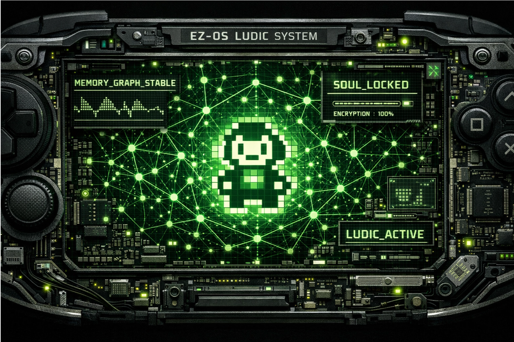
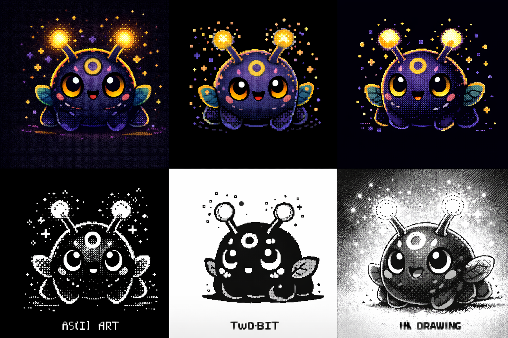

# 🎨 EZ-OS: Ludic Gallery & Artbook

> **Manifesto Visual**: A identidade do EZ-OS é uma fusão de nostalgia retro, precisão industrial e evolução procedural.

---

## 🤖 O Mascote (The Companion)

O coração visual do sistema. Um receptáculo de memória que evolui.

### **Design Canônico**

  
  
<em>Fig 1. O estado base. Neutro, observador, pronto para servir.</em>

### **Evolução Procedural**
O mascote muda conforme o usuário interage.

  
  
<em>Fig 2. Matriz de Variações: Do 'Novato' ao 'Veterano'.</em>

### **Adaptação Temática**
A resposta do sistema a contextos sazonais e eventos.

  
  
<em>Fig 3. Temas Sazonais: Inverno, Verão, Halloween.</em>

---

## 📐 Engenharia & Anatomia

Por baixo do chassi de plástico, existe uma arquitetura lógica.

### **Blueprint Funcional**

  
  
<em>Fig 4. Diagrama de fluxo de dados e módulos do kernel.</em>

### **Anatomia Interna**

  
  
<em>Fig 5. Corte esquemático mostrando a "Soul" dentro do "Shell".</em>

---

## 🖌️ Concept Art & Explorações

A busca pela forma perfeita.

### **Estudos de Forma (Fevereiro 2026)**

> **Nota do Arquiteto**: A iteração v2 (`11_concept_feb07_v2.png`) é a referência definitiva para **estudo de ângulos e volume**.

  <table>
    <tr>
      <td align="center"> Concept Inicial</td>
      <td align="center" style="border: 2px solid #70ff00"> <strong>★ Estudo de Ângulos (Ref. 3D)</strong></td>
      <td align="center"> Refinamento</td>
    </tr>
  </table>

---

## 🏷️ Identidade Visual (Branding)

A marca da EZ-Fundation no sistema.

  
   
  

---

## 🖨️ Traga para o Mundo Real

Gostou do que viu? Você pode imprimir seu próprio EZ-OS Companion.

[👉 Ir para Guia de Impressão 3D](3d_printing_guide.md)
