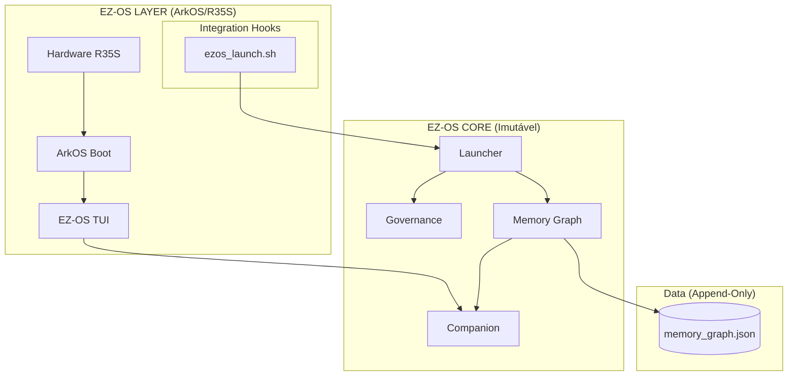

# Diagrama Arquitetural: EZ-OS v1.0

## Fluxo Canônico
1. **Boot**: ArkOS inicia e chama a `TUI`.
2. **Seleção**: Usuário escolhe um jogo.
3. **Hook**: `ezos_launch.sh` registra `START` via `Launcher`.
4. **Jogo**: O jogo roda via RetroArch.
5. **Retorno**: Ao fechar, o hook registra `STOP` e recarrega a `TUI`.
6. **Simbiose**: O `Companion` lê o novo estado da `Memory` e atualiza sua forma.
